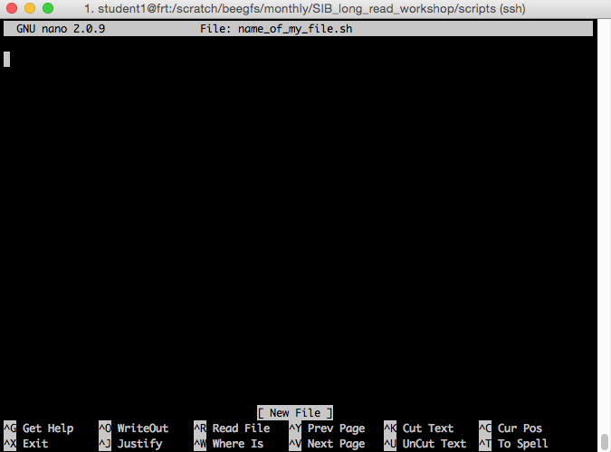
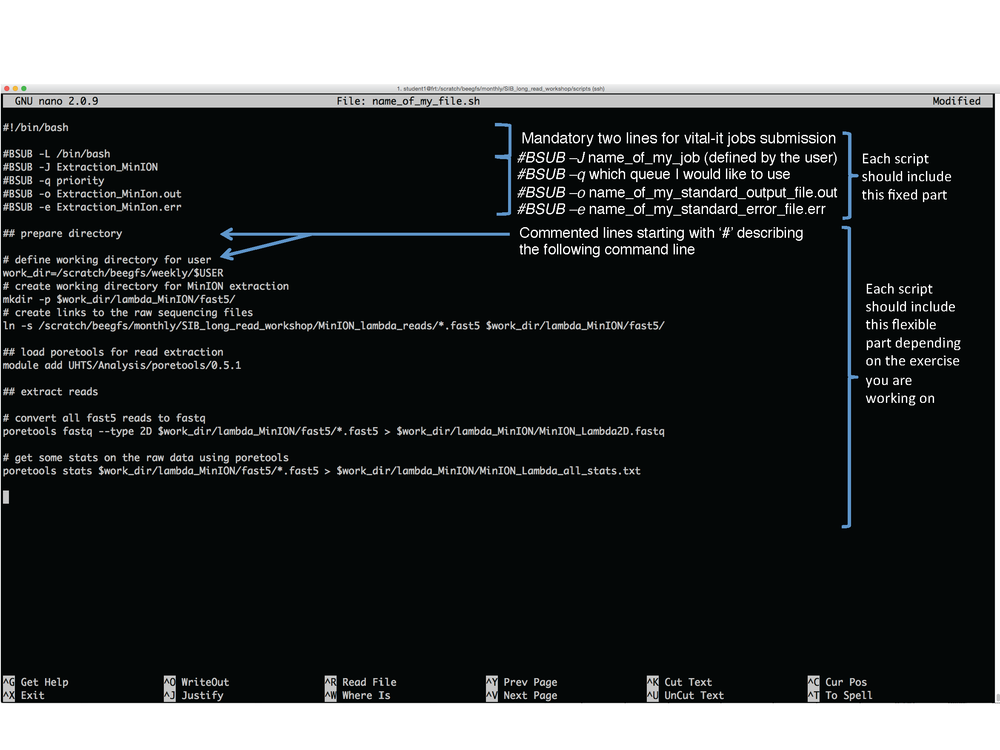

Once connected to prd.vital-it.ch and your working directory created in /scratch/beegfs/weekly/<username>, 
follow the steps below to create a script and submit it to Vital-it computing nodes.

### Writing scripts
If you don't know how to use a text editor in a Terminal i.e. Unix command line window, the easiest way to start is using ```nano``` 

1- In order to create an empty script and start filling it, from your current directory i.e.  ```/scratch/beegfs/weekly/<username>```,
type:

```nano name_of_my_script.sh```

The command above will create a text file called "name_of_my_script.sh" (of course you need to set a proper name according to the exercise)
and will open access it. You should see something like this:


2- A typical script to be executed on Vital-it nodes should be written this way (this is the an example based on the 1st exercise MinIon-extraction):


3- When done in order to save your ```name_of_my_script.sh``` 

press: ```Ctrl+X```  

You will prompt to save you script:

press: ```y``` then ENTER

Note: If you want to save your script at any time without exiting:

press: ```Ctrl+O``` then ENTER

Your script is now saved you can list it using ```ls``` command or open it again for modications using ```nano name_of_my_script.sh```


### Execute and Check jobs on Vital-it:

1 - To run the ```name_of_my_script.sh``` on Vital-it:

type:

```bsub < name_of_my_script.sh```

You will be notified that your job <jobid (a number)> has been submitted.

2- To check the status of your job, type: ```bjobs```. Under Status you can see if your job is: 'RUN' (running) or 'PEND' (pending)
   
   To check if your job is done, type ```bjobs <jobid>```. Under Status you can see if your job is: 'DONE' (finished) or 'EXIT' (an error occured)

3- If your job is 'DONE' check the output files in the appropriate location and continue the practicals
   Else check the 'standard_error_file.err' using ```cat name_of_my_standard_error_file.err``` and debug before re-running point 1.
   
   

   


